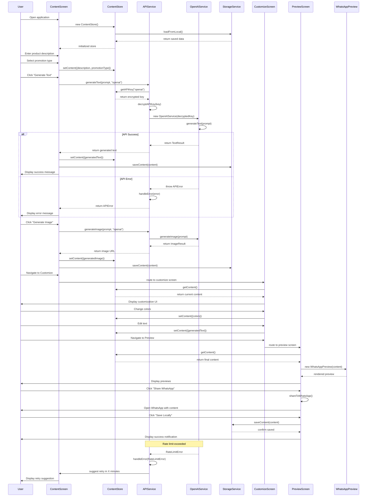

# System Design - App Promocional IA

## Implementation approach

We will develop a Single Page Application (SPA) using React with TypeScript as the foundation, leveraging Shadcn-ui components and Tailwind CSS for a modern, responsive interface. The architecture will be built around a modular design with clear separation of concerns.

**Key Technical Decisions:**
- **Frontend Framework**: React 18+ with TypeScript for type safety and better developer experience
- **UI Library**: Shadcn-ui components with Tailwind CSS for consistent, customizable design system
- **State Management**: Zustand for lightweight, scalable state management across the application
- **API Integration**: Custom service layer with axios for HTTP requests and proper error handling
- **Storage**: IndexedDB with Dexie.js for robust local storage of content and settings
- **Security**: Client-side encryption for API keys using Web Crypto API
- **Build Tool**: Vite for fast development and optimized production builds

**Difficult Points Analysis:**
1. **Multiple AI API Management**: Different response formats, rate limits, and error handling across 5 different AI services
2. **Real-time Preview System**: Dynamic rendering of WhatsApp/Instagram formats with accurate styling
3. **Secure API Key Storage**: Client-side encryption without compromising usability
4. **Responsive Design**: Ensuring consistent experience across desktop and mobile devices
5. **Error Recovery**: Graceful handling of API failures with fallback mechanisms

**Selected Open-Source Libraries:**
- `@radix-ui/react-*` - Accessible UI primitives through Shadcn-ui
- `zustand` - Lightweight state management
- `dexie` - IndexedDB wrapper for local storage
- `axios` - HTTP client with interceptors
- `react-hook-form` - Form handling and validation
- `zod` - Runtime type validation
- `lucide-react` - Icon library
- `date-fns` - Date manipulation utilities

## Data structures and interfaces

```mermaid
classDiagram
    class App {
        +render() JSX.Element
        +main() void
    }

    class ContentStore {
        -content: ContentData
        -apiKeys: APIKeys
        -settings: UserSettings
        +setContent(content: ContentData) void
        +getContent() ContentData
        +setAPIKey(provider: string, key: string) void
        +getAPIKey(provider: string) string
        +saveToLocal() Promise~void~
        +loadFromLocal() Promise~void~
    }

    class APIService {
        -httpClient: AxiosInstance
        +generateText(prompt: string, provider: string) Promise~TextResult~
        +generateImage(prompt: string, provider: string) Promise~ImageResult~
        +validateAPIKey(provider: string, key: string) Promise~boolean~
        -handleError(error: AxiosError) APIError
    }

    class OpenAIService {
        -apiKey: string
        -baseURL: string
        +generateText(prompt: string) Promise~TextResult~
        +generateImage(prompt: string) Promise~ImageResult~
        +validateKey() Promise~boolean~
    }

    class ClaudeService {
        -apiKey: string
        -baseURL: string
        +generateText(prompt: string) Promise~TextResult~
        +validateKey() Promise~boolean~
    }

    class GeminiService {
        -apiKey: string
        -baseURL: string
        +generateText(prompt: string) Promise~TextResult~
        +generateImage(prompt: string) Promise~ImageResult~
        +validateKey() Promise~boolean~
    }

    class GrookService {
        -apiKey: string
        -baseURL: string
        +generateText(prompt: string) Promise~TextResult~
        +validateKey() Promise~boolean~
    }

    class DeepseekService {
        -apiKey: string
        -baseURL: string
        +generateText(prompt: string) Promise~TextResult~
        +validateKey() Promise~boolean~
    }

    class StorageService {
        -db: Dexie
        +saveContent(content: ContentData) Promise~void~
        +loadContent(id: string) Promise~ContentData~
        +listContents() Promise~ContentData[]~
        +deleteContent(id: string) Promise~void~
        +encryptAPIKey(key: string) Promise~string~
        +decryptAPIKey(encryptedKey: string) Promise~string~
    }

    class ContentScreen {
        -store: ContentStore
        -apiService: APIService
        +handleSubmit(data: FormData) Promise~void~
        +generateText() Promise~void~
        +generateImage() Promise~void~
        +render() JSX.Element
    }

    class CustomizeScreen {
        -store: ContentStore
        +updateColors(colors: ColorSettings) void
        +updateText(text: string) void
        +render() JSX.Element
    }

    class PreviewScreen {
        -store: ContentStore
        +shareToWhatsApp() void
        +saveLocally() Promise~void~
        +copyToClipboard() void
        +render() JSX.Element
    }

    class WhatsAppPreview {
        -content: ContentData
        +render() JSX.Element
    }

    class InstagramPreview {
        -content: ContentData
        +render() JSX.Element
    }

    class ErrorBoundary {
        -hasError: boolean
        +componentDidCatch(error: Error) void
        +render() JSX.Element
    }

    class ContentData {
        +id: string
        +description: string
        +promotionType: PromotionType
        +generatedText: string
        +generatedImage: string
        +colors: ColorSettings
        +createdAt: Date
        +updatedAt: Date
    }

    class APIKeys {
        +openai: string
        +claude: string
        +gemini: string
        +grook: string
        +deepseek: string
    }

    class ColorSettings {
        +background: string
        +text: string
        +accent: string
    }

    class TextResult {
        +content: string
        +provider: string
        +tokens_used: number
        +cost: number
    }

    class ImageResult {
        +url: string
        +provider: string
        +cost: number
    }

    class APIError {
        +message: string
        +code: string
        +provider: string
        +retryable: boolean
    }

    %% Relationships
    App --> ContentStore
    App --> ContentScreen
    App --> CustomizeScreen
    App --> PreviewScreen
    App --> ErrorBoundary

    ContentStore --> StorageService
    ContentStore --> ContentData
    ContentStore --> APIKeys

    APIService --> OpenAIService
    APIService --> ClaudeService
    APIService --> GeminiService
    APIService --> GrookService
    APIService --> DeepseekService

    ContentScreen --> APIService
    ContentScreen --> ContentStore
    CustomizeScreen --> ContentStore
    PreviewScreen --> ContentStore
    PreviewScreen --> WhatsAppPreview
    PreviewScreen --> InstagramPreview

    OpenAIService --> TextResult
    OpenAIService --> ImageResult
    ClaudeService --> TextResult
    GeminiService --> TextResult
    GeminiService --> ImageResult
    GrookService --> TextResult
    DeepseekService --> TextResult

    ContentData --> ColorSettings
    StorageService --> ContentData
    StorageService --> APIKeys

    APIService --> APIError
```

## Program call flow

## Anything UNCLEAR

1. **API Rate Limiting Strategy**: The PRD doesn't specify how to handle different rate limits across AI providers. Should we implement a queuing system or automatic provider switching when limits are reached?

2. **Image Storage Approach**: Generated images from AI APIs are typically temporary URLs. Should we download and store images locally via IndexedDB, or maintain references to external URLs with expiration handling?

3. **Offline Functionality**: The requirement mentions local storage but it's unclear if the app should work offline. Should we implement service workers for offline-first functionality, or is it acceptable to require internet connectivity for AI API calls?

4. **API Key Validation Frequency**: How often should we validate API keys? On every request, periodically, or only when users update them?

5. **Content Versioning**: Should we maintain version history of generated content to allow users to revert changes, or is a single state sufficient?

6. **Multi-language Support**: While focused on Brazilian Portuguese, should the system architecture support future internationalization, or optimize specifically for Portuguese content generation?

7. **Content Moderation**: Should we implement content filtering for generated text/images to ensure appropriate promotional content, especially for different business sectors?

8. **Performance Optimization**: For mobile devices with limited resources, should we implement lazy loading for AI-generated images and progressive enhancement for complex features?