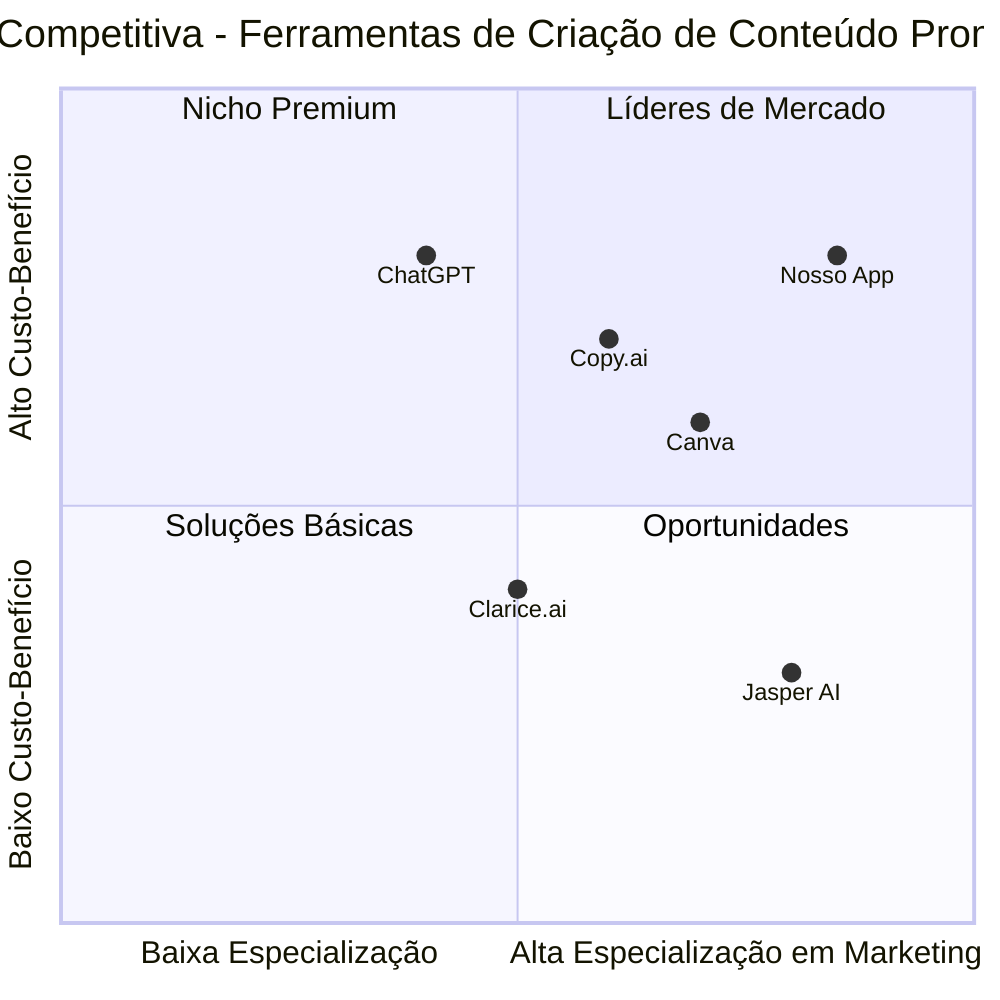

# PRD - Aplicativo Web de Criação de Conteúdo Promocional com IA

## 1. Informações do Projeto

**Linguagem:** Português (Brasil)  
**Linguagens de Programação:** Shadcn-ui, TypeScript e Tailwind CSS  
**Nome do Projeto:** app_promocional_ia  
**Data:** 16 de Julho de 2025

### Requerimentos Originais
Desenvolver um aplicativo web que permita que usuários criem conteúdos promocionais de alta qualidade utilizando inteligência artificial, integrando APIs como OpenAI, Gemini, Grook, Claude e Deepseek. O app deve ser focado no marketing brasileiro, oferecendo funcionalidades como inserção de descrição de produtos/serviços, seleção de estilo de promoção, geração de textos persuasivos e imagens com IA, pré-visualização em formatos WhatsApp e Instagram, personalização visual, armazenamento local e compartilhamento direto.

## 2. Definição do Produto

### 2.1 Objetivos do Produto

1. **Democratizar a criação de conteúdo promocional profissional** para pequenas e médias empresas brasileiras através da integração de múltiplas APIs de IA
2. **Otimizar o tempo de criação de materiais promocionais** reduzindo de horas para minutos o processo de desenvolvimento de campanhas visuais e textuais
3. **Personalizar conteúdo para o mercado brasileiro** oferecendo templates e estilos adaptados às preferências e comportamentos do consumidor nacional

### 2.2 Histórias de Usuário

1. **Como pequeno empresário**, eu quero gerar rapidamente textos promocionais persuasivos para meus produtos **para que eu possa** criar campanhas eficazes no WhatsApp e Instagram sem precisar contratar um copywriter

2. **Como profissional de marketing**, eu quero integrar múltiplas APIs de IA em uma única plataforma **para que eu possa** comparar resultados e escolher a melhor opção para cada tipo de campanha

3. **Como empreendedor digital**, eu quero pré-visualizar meus conteúdos nos formatos do WhatsApp e Instagram **para que eu possa** ajustar o visual antes de publicar nas redes sociais

4. **Como usuário não-técnico**, eu quero gerenciar minhas chaves de API de forma simples e segura **para que eu possa** utilizar diferentes serviços de IA sem complicações técnicas

5. **Como criador de conteúdo**, eu quero personalizar cores e elementos visuais das minhas promoções **para que eu possa** manter a identidade visual da minha marca

### 2.3 Análise Competitiva

#### Concorrentes Principais:

**1. Canva**
- **Prós:** Interface intuitiva, biblioteca extensa de templates, recursos de IA nativos, colaboração em equipe
- **Contras:** Foco mais visual que textual, limitações na personalização de textos com IA, preço elevado para recursos premium (R$ 25-34,90/mês)

**2. Jasper AI**
- **Prós:** Especializado em copywriting, múltiplos templates de marketing, controle de voz da marca
- **Contras:** Focado apenas em texto, sem recursos visuais, preço alto ($49/mês), interface em inglês

**3. Copy.ai**
- **Prós:** Plano gratuito disponível, fácil de usar, boa para iniciantes
- **Contras:** Migrou foco para vendas, recursos limitados de marketing, sem editor visual

**4. ChatGPT (OpenAI)**
- **Prós:** Líder de mercado (34,9% de adoção), versatilidade, qualidade de texto
- **Contras:** Sem interface específica para marketing, não gera imagens nativamente, requer prompts elaborados

**5. Clarice.ai (Brasileiro)**
- **Prós:** Treinado em português, foco no mercado brasileiro
- **Contras:** Recursos limitados, menos conhecimento de mercado, sem integração visual

### 2.4 Quadrante Competitivo



## 3. Especificações Técnicas

### 3.1 Análise de Requisitos

O aplicativo deve ser uma Single Page Application (SPA) responsiva que integre múltiplas APIs de IA para geração de conteúdo textual e visual. A arquitetura deve priorizar a experiência do usuário brasileiro com interfaces em português, templates localizados e funcionalidades específicas para WhatsApp e Instagram.

**Requisitos Técnicos Principais:**
- Frontend reativo com TypeScript e Tailwind CSS
- Sistema de gerenciamento de estado para múltiplas APIs
- Armazenamento local seguro para chaves de API e conteúdos
- Interface responsiva otimizada para desktop e mobile
- Sistema de pré-visualização em tempo real
- Integração nativa com APIs de compartilhamento social

### 3.2 Pool de Requisitos

#### Requisitos P0 (Críticos - Must Have)
- **REQ-001:** Sistema de inserção de descrição de produtos/serviços com validação
- **REQ-002:** Integração com pelo menos 3 APIs de IA (OpenAI, Claude, Gemini)
- **REQ-003:** Geração de textos promocionais em português brasileiro
- **REQ-004:** Seleção de tipos de promoção (desconto, evento, lançamento, geral)
- **REQ-005:** Sistema de gerenciamento seguro de chaves de API
- **REQ-006:** Armazenamento local de conteúdos gerados
- **REQ-007:** Interface responsiva para desktop e mobile
- **REQ-008:** Tratamento de erros de API com mensagens em português

#### Requisitos P1 (Importantes - Should Have)
- **REQ-009:** Geração de imagens com DALL-E e Gemini
- **REQ-010:** Pré-visualização em formato WhatsApp e Instagram
- **REQ-011:** Personalização de cores de fundo e texto
- **REQ-012:** Sistema de compartilhamento direto para WhatsApp
- **REQ-013:** Editor visual para ajustes de conteúdo
- **REQ-014:** Templates pré-definidos para diferentes setores
- **REQ-015:** Sistema de histórico de conteúdos gerados

#### Requisitos P2 (Desejáveis - May Have)
- **REQ-016:** Integração com Grook e Deepseek APIs
- **REQ-017:** Export em múltiplos formatos (PNG, JPG, PDF)
- **REQ-018:** Sistema de tags e categorização
- **REQ-019:** Análise de performance de conteúdos
- **REQ-020:** Agendamento de publicações
- **REQ-021:** Integração com Instagram API
- **REQ-022:** Sistema de colaboração em equipe

### 3.3 Rascunho de Design da Interface

#### Tela 1: "Conteúdo" (Página Principal)
```
┌─────────────────────────────────────────────────────────────┐
│ [Logo] App Promocional IA                    [⚙️ Config APIs] │
├─────────────────────────────────────────────────────────────┤
│                                                             │
│ 📝 DESCREVA SEU PRODUTO/SERVIÇO                             │
│ ┌─────────────────────────────────────────────────────────┐ │
│ │ Ex: Curso online de marketing digital para iniciantes  │ │
│ │                                                         │ │
│ └─────────────────────────────────────────────────────────┘ │
│                                                             │
│ 🎯 TIPO DE PROMOÇÃO                                         │
│ [💰 Desconto] [🎉 Evento] [🚀 Lançamento] [📢 Geral]        │
│                                                             │
│ 🤖 ESCOLHA A IA                                             │
│ [OpenAI] [Claude] [Gemini] [Grook] [Deepseek]              │
│                                                             │
│ ┌─────────────────┐ ┌─────────────────┐                     │
│ │ 📝 GERAR TEXTO  │ │ 🖼️ GERAR IMAGEM │                     │
│ └─────────────────┘ └─────────────────┘                     │
│                                                             │
│ ⚠️ [Área de mensagens de erro/sucesso]                      │
└─────────────────────────────────────────────────────────────┘
```

#### Tela 2: "Personalizar"
```
┌─────────────────────────────────────────────────────────────┐
│ ← Voltar | PERSONALIZAR | Avançar →                          │
├─────────────────────────────────────────────────────────────┤
│ ┌─────────────────────┐ ┌─────────────────────────────────┐ │
│ │ 🎨 CORES           │ │ PREVIEW                         │ │
│ │                    │ │ ┌─────────────────┐             │ │
│ │ Fundo: [🎨]        │ │ │                 │             │ │
│ │ Texto: [🎨]        │ │ │  [Conteúdo      │             │ │
│ │ Destaque: [🎨]     │ │ │   Gerado]       │             │ │
│ │                    │ │ │                 │             │ │
│ │ ✏️ EDITOR          │ │ └─────────────────┘             │ │
│ │ ┌─────────────────┐│ │                                 │ │
│ │ │ Texto editável  ││ │ 📱 [WhatsApp] [Instagram]      │ │
│ │ └─────────────────┘│ │                                 │ │
│ └─────────────────────┘ └─────────────────────────────────┘ │
└─────────────────────────────────────────────────────────────┘
```

#### Tela 3: "Visualizar"
```
┌─────────────────────────────────────────────────────────────┐
│ ← Voltar | VISUALIZAR E COMPARTILHAR                         │
├─────────────────────────────────────────────────────────────┤
│                                                             │
│ 📱 PREVIEW WHATSAPP          📷 PREVIEW INSTAGRAM           │
│ ┌─────────────────────┐      ┌─────────────────────┐       │
│ │ [Contato]           │      │     [@usuario]      │       │
│ │ Hoje 14:30         │      │                     │       │
│ │                    │      │ ┌─────────────────┐ │       │
│ │ [Conteúdo Gerado]  │      │ │                 │ │       │
│ │                    │      │ │   [Imagem]      │ │       │
│ │ ✓✓                 │      │ │                 │ │       │
│ └─────────────────────┘      │ └─────────────────┘ │       │
│                              │ [Texto da legenda]  │       │
│                              │ ❤️ 💬 📤           │       │
│                              └─────────────────────┘       │
│                                                             │
│ ┌─────────────────┐ ┌─────────────────┐ ┌─────────────────┐│
│ │ 💾 SALVAR LOCAL │ │ 📤 WHATSAPP     │ │ 📋 COPIAR      ││
│ └─────────────────┘ └─────────────────┘ └─────────────────┘│
│                                                             │
│ 🔔 [Área de notificações de sucesso/erro]                   │
└─────────────────────────────────────────────────────────────┘
```

### 3.4 Questões em Aberto

1. **Limitações de API:** Como gerenciar diferentes limites de rate das APIs de IA de forma transparente para o usuário?

2. **Armazenamento de Chaves:** Qual o nível de criptografia necessário para armazenar as chaves de API localmente de forma segura?

3. **Personalização de Templates:** Devemos incluir templates específicos por setor (alimentação, moda, serviços) ou manter genérico?

4. **Integração com Redes Sociais:** É viável integrar diretamente com APIs do Instagram e WhatsApp Business ou focar apenas em exports?

5. **Monetização:** O modelo será freemium com limitações de uso ou será necessário um plano de assinatura desde o início?

6. **Conformidade LGPD:** Quais dados do usuário serão coletados e como garantir conformidade com a Lei Geral de Proteção de Dados?

7. **Offline First:** Deve funcionar offline após o primeiro carregamento ou será necessária conexão constante para as APIs?

8. **Backup e Sincronização:** Como implementar backup na nuvem dos conteúdos salvos localmente sem comprometer a privacidade?

## 4. Cronograma de Desenvolvimento Sugerido

### Fase 1 (4-6 semanas): MVP Core
- Implementação da interface base com Shadcn-ui
- Integração com OpenAI e Claude APIs
- Funcionalidades de geração de texto
- Sistema básico de armazenamento local
- Telas principais funcionais

### Fase 2 (3-4 semanas): Recursos Visuais
- Integração com APIs de geração de imagem
- Sistema de personalização de cores
- Pré-visualização WhatsApp e Instagram
- Editor visual básico

### Fase 3 (2-3 semanas): Funcionalidades Avançadas
- Integração com APIs adicionais (Gemini, Grook, Deepseek)
- Sistema de compartilhamento
- Templates pré-definidos
- Tratamento avançado de erros

### Fase 4 (2 semanas): Polimento e Testes
- Testes de usabilidade
- Otimizações de performance
- Ajustes de UX/UI
- Documentação final

## 5. Critérios de Sucesso

### Métricas de Produto
- **Taxa de Conversão:** 15% dos visitantes devem gerar pelo menos um conteúdo
- **Retenção:** 40% dos usuários devem retornar dentro de 7 dias
- **Tempo de Geração:** Menos de 30 segundos para gerar texto + imagem
- **Satisfação:** NPS acima de 50 nos primeiros 3 meses

### Métricas Técnicas
- **Performance:** Tempo de carregamento inicial < 3 segundos
- **Disponibilidade:** 99.5% de uptime
- **Compatibilidade:** Funcionar em 95% dos navegadores modernos
- **Responsividade:** Interface adaptável para telas de 320px a 1920px

### Métricas de Negócio
- **Custo por Usuário:** Manter custos de API abaixo de R$ 2,00 por usuário/mês
- **Crescimento:** 25% de crescimento mensal na base de usuários ativos
- **Engagement:** Média de 3 conteúdos gerados por sessão ativa